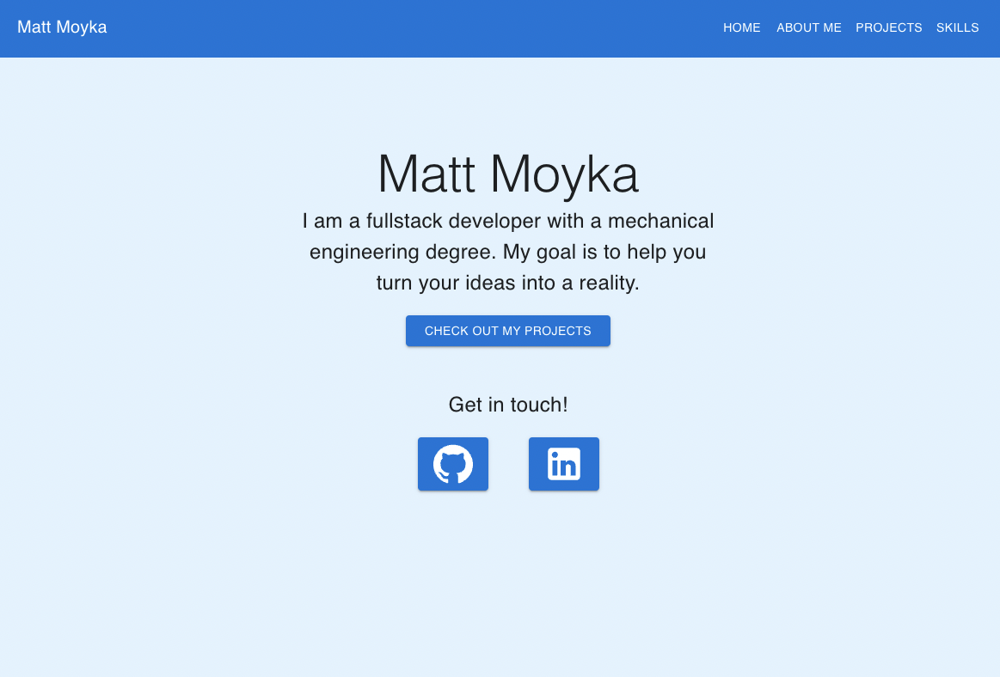
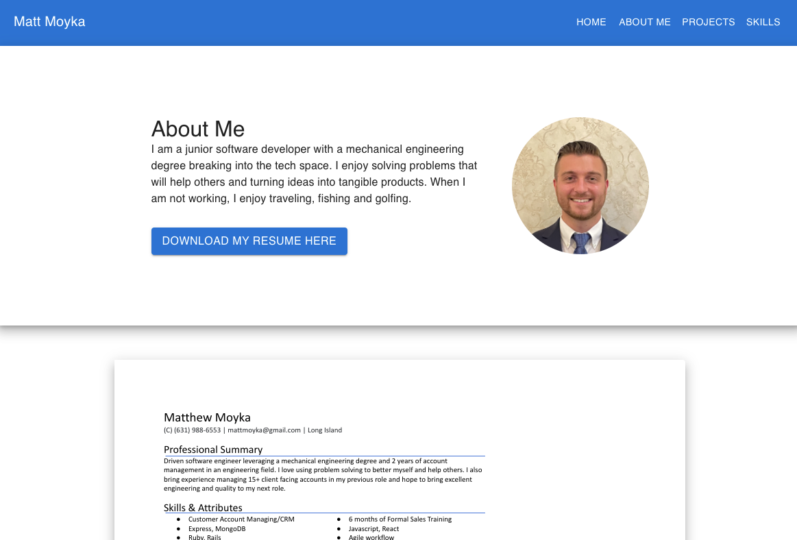
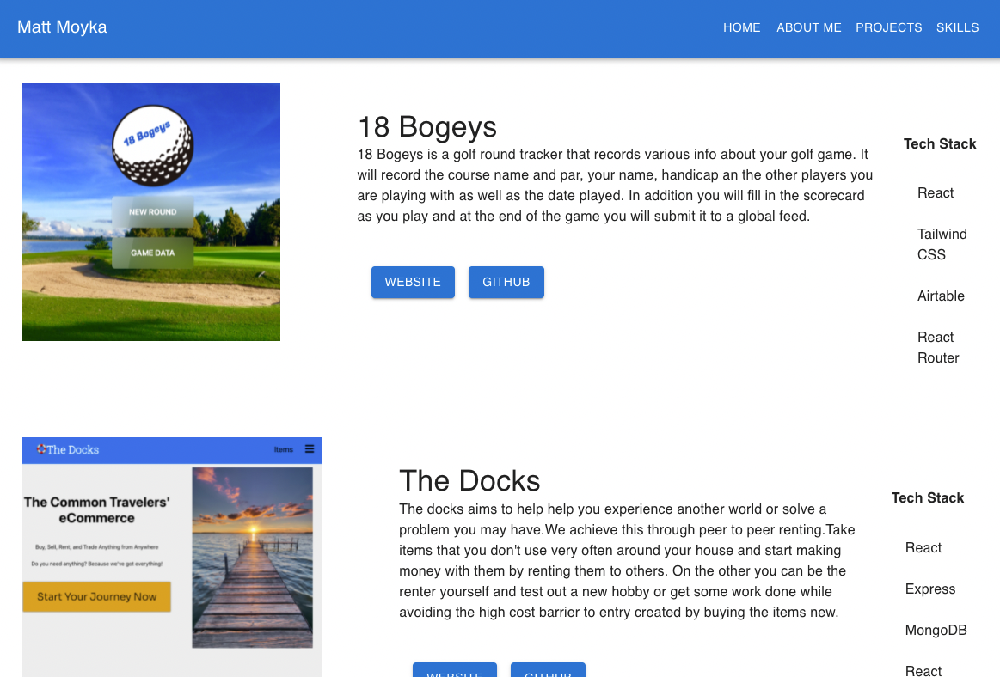
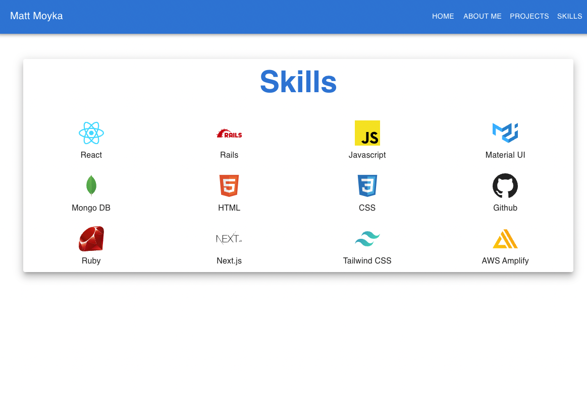

# PortfolioWebsite

# [Click to view deployed site](https://www.mattmoyka.com/)

- [Overview](#overview)
- [MVP](#mvp)
  - [Goals](#goals)
  - [Libraries and Dependencies](#libraries-and-dependencies)
  - [Client (Front End)](#client-front-end)
 
    - [Component Architecture](#component-architecture)
    - [Time Estimates](#time-estimates)


<br>

## Overview

_**My Portfolio Website** displays my most impressive projects along with a little bit about me and my skills._


<br>

## MVP


_The **SalesVerse** MVP will show off my projects, about me and my skills. A visitor will be able to download my resume as well as visit my github and linkedin._

<br>

### Goals

- Create a clean interface that is simple to use.
- Display the data that is important to the visitor.


<br>

### Libraries and Dependencies


|     Library      | Description                                |
| :--------------: | :----------------------------------------- |
|      React       | Front end framework.|
|   React Router   | Create routing in the app.|
| Material UI | Elegant Styling. |


<br>

### Client (Front End)

#### Wireframes


- Landing Page


- About Me



- Projects Page



- Skills Page




#### Component Architecture


``` structure

src

|__ App.jsx

|__ screens/
      |__ Aboutme.jsx
      |__ Landing.jsx
      |__ Projects.jsx
      |__ screen.css
      |__ Skills.jsx
      
|__ layout/
      |__ Layout.jsx
      |__ Footer.jsx
      |__ Navbar.jsx


```

#### Time Estimates


In total this project took me 5 hours to build out and every so often I revisit it to make changes.

<br>


